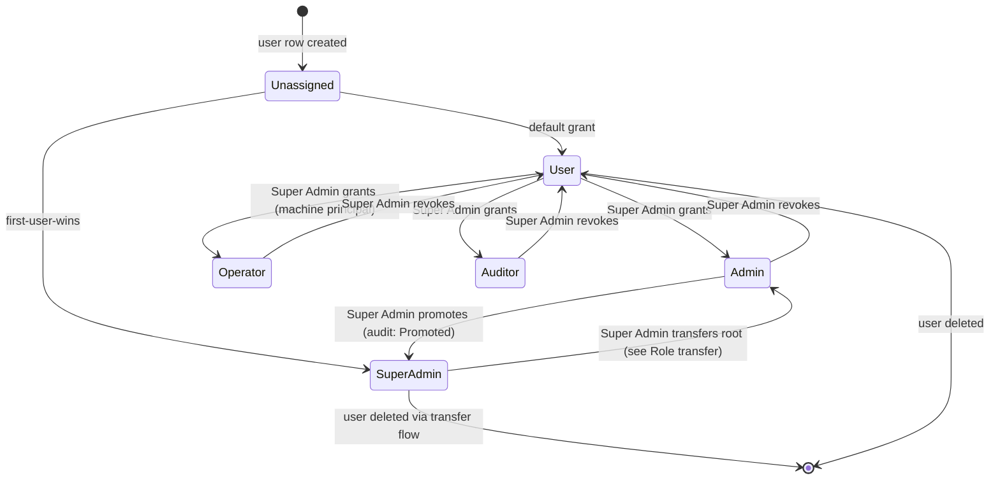

# Actors and Roles

**Version:** 1.0.0
**Updated:** 2026-07-20
**AI Confidence:** Draft
**Ambiguity:** Low

---

## Keywords

`super-admin` · `first-user-wins` · `bootstrap` · `role-lifecycle` · `deputy` · `revocation` · `user_roles` · `system_bootstrap`

---

## Scoring

| Criterion | Status |
|-----------|--------|
| `00-overview.md` present in module | ✅ |
| AI Confidence assigned | ✅ |
| Ambiguity assigned | ✅ |
| Keywords present | ✅ |
| Scoring table present | ✅ |

---

## Purpose

This document is the normative contract for actors, roles, and the first-user-becomes-Super-Admin bootstrap. It pins the DB shape (`user_roles`, `system_bootstrap`), the transactional bootstrap sequence, the role lifecycle state chart, deputy delegation rules, revocation semantics, and the audit hooks that every role mutation must emit. Casbin subject IDs and grouping rows in `02-casbin-integration.md` and matrix rows in `03-permission-matrix.md` bind to the names defined here; no other file may introduce a new role name.

---

## Specification

### Actor catalogue (normative)

| Actor | Principal type | Persisted? | Auth surface | Default capability set |
|-------|----------------|------------|--------------|------------------------|
| Super Admin | Human | Yes (`user_roles.role = 'super_admin'`) | Session (Sanctum) | Full: `Backup.*`, `Snapshot.*`, `Role.Manage`, `System.Configure`, all lower roles |
| Admin | Human | Yes (`user_roles.role = 'admin'`) | Session | Explicit grants only. Baseline: `Backup.Read`, `Snapshot.Read` |
| Operator | Machine | Yes (`user_roles.role = 'operator'`) | Signed job token, no session | `Backup.Export` (scheduled only), `Snapshot.Create` (retention job). Never `Import` / `Restore` unless `MaintenanceMode` on |
| Auditor | Human | Yes (`user_roles.role = 'auditor'`) | Session | `AuditLog.Read`. Zero Backup/Snapshot capabilities |
| User | Human | Yes (`user_roles.role = 'user'`) | Session | None on this module. Routes return canonical `Forbidden` envelope |

Role names are lowercase, snake\_case, and enumerated in the `app_role` enum. Adding a role is a schema migration plus a Casbin policy change, never a code-only constant.

### Role vocabulary

- **Role**: a named bundle of capabilities defined by Casbin policy rows.
- **Capability**: a `Domain.Action` pair (e.g. `Snapshot.Restore`). Never a wildcard in policy.csv except for `super_admin` inheritance via `g` rows.
- **Grant**: a `(user_id, role)` row in `user_roles`, mirrored to Casbin `g` rows by the sync job.
- **Deputy**: a Super Admin who has explicitly delegated a subset of `Role.Manage` to an Admin for a bounded time window. See "Deputy delegation" below.
- **Revocation**: removing a grant. Idempotent; produces an audit row even when the grant did not exist (recorded as `NoOp` reason).

### First-user-wins bootstrap (normative)

The bootstrap invariant is that the first user row inserted into `users` on a fresh install auto-elevates to `super_admin` in the same DB transaction. The race is closed by a sentinel row in `system_bootstrap` that every registration `SELECT ... FOR UPDATE`s before deciding whether the incoming user is the first.

#### DB shape

```sql
CREATE TABLE public.system_bootstrap (
  id smallint PRIMARY KEY DEFAULT 1 CHECK (id = 1),
  first_user_id uuid NULL REFERENCES auth.users(id) ON DELETE RESTRICT,
  bootstrapped_at timestamptz NULL,
  bootstrap_request_id uuid NULL
);

GRANT SELECT ON public.system_bootstrap TO authenticated;
GRANT ALL ON public.system_bootstrap TO service_role;
ALTER TABLE public.system_bootstrap ENABLE ROW LEVEL SECURITY;

CREATE POLICY "Bootstrap row is readable by authenticated"
  ON public.system_bootstrap FOR SELECT
  TO authenticated USING (true);

-- Only service_role (server-side registration) writes this row.

INSERT INTO public.system_bootstrap (id) VALUES (1) ON CONFLICT DO NOTHING;
```

The DDL and grants follow the project's public-schema grants rule and the user-roles memory (roles in a separate table, `has_role()` security definer already in the codebase from an earlier plan).

#### Registration transaction (normative sequence)

The `RegisterUser` server-side handler executes exactly this sequence inside a single DB transaction:

1. `BEGIN`
2. `SELECT * FROM system_bootstrap WHERE id = 1 FOR UPDATE` (row-level lock, blocks concurrent registrations).
3. `INSERT INTO users (...)` returning the new `user_id`.
4. Decision:
   - If `first_user_id IS NULL`: `INSERT INTO user_roles (user_id, role) VALUES (:user_id, 'super_admin')`, then `UPDATE system_bootstrap SET first_user_id = :user_id, bootstrapped_at = now(), bootstrap_request_id = :request_id WHERE id = 1`.
   - Else: `INSERT INTO user_roles (user_id, role) VALUES (:user_id, 'user')`.
5. Enqueue Casbin `g` sync job (idempotent) for the new grant.
6. Write an audit row `AuditEvent.RoleGranted` (see "Audit hooks").
7. `COMMIT`. Any failure `ROLLBACK`s and the caller sees a `LaraException` (canonical envelope).

Two concurrent first registrations serialize on step 2; the loser observes `first_user_id IS NOT NULL` after acquiring the lock and takes the `'user'` branch. No polling, no eventual consistency.

#### Bootstrap failure modes

| Condition | Behaviour |
|-----------|-----------|
| `system_bootstrap` row missing (migration not run) | Fail closed: registration returns `Envelope.Error` with `ErrorCode = BootstrapMissing`, no user row created |
| `first_user_id` set but user was deleted | `system_bootstrap.first_user_id` is `ON DELETE RESTRICT`; deletion of the first user must go through a Super Admin transfer flow (see "Role transfer") |
| Casbin `g` sync job fails after commit | Audit row `RoleSyncPending` written; retry queue picks it up. UI treats the user as their DB role via `has_role()` in the meantime |

### Role lifecycle state chart



Rules:

- A user has exactly one primary role at any instant. Additional capabilities are not stacked via multi-role; they are expressed as Casbin `p` rows scoped to the user's subject when needed.
- The `SuperAdmin -> Admin` transition is only reachable through the Role Transfer flow (see next section), never a bare revocation.
- Every transition is atomic (DB transaction) and writes exactly one audit row.

### Role transfer (Super Admin succession)

There must be at least one Super Admin at all times. To retire the current Super Admin, the flow is:

1. Current Super Admin invokes `POST /Api/V1/Admin/Roles/Transfer` with the target user id.
2. Server verifies target is an `Admin` (not `User`, `Operator`, `Auditor`).
3. In one transaction: promote target to `super_admin`, demote self to `admin`, write two audit rows (`RolePromoted`, `RoleDemoted`) sharing one `RequestId`.
4. Casbin `g` sync job re-writes both grouping rows.

Attempting to demote the sole Super Admin without a transfer target returns `SoleSuperAdminProtected` envelope error.

### Deputy delegation

A Super Admin may delegate a bounded subset of `Role.Manage` to an Admin for a fixed window (max 24h, configurable per install). Deputy rows live in `role_deputies (deputy_user_id, granted_by, capabilities jsonb, expires_at)` and are consulted by the Casbin adapter as scoped `p` rows with a time predicate. On expiry, the sync job removes the `p` rows and writes `DeputyExpired`. Deputy grants never include `Backup.Import` or `Snapshot.Restore`; those two capabilities are Super-Admin-only regardless of delegation.

### Revocation semantics

- Revocation is idempotent: revoking a grant that does not exist returns 200 with `Attributes.Revoked = false` and writes an audit row with reason `NoOp`.
- Revocation is immediate: Casbin `g` sync job runs synchronously on revoke to close the privilege window before the API responds. If the sync job fails, the DB grant is rolled back.
- Revoking your own `super_admin` role is denied (`SoleSuperAdminProtected` or `SelfRevokeDenied`, whichever applies first).

### Audit hooks (mandatory)

Every role mutation writes exactly one row to `role_audit_log`:

| Event | Fields | Emitted from |
|-------|--------|--------------|
| `RoleGranted` | `user_id`, `role`, `granted_by`, `request_id`, `reason` | Registration txn, admin grant handler |
| `RoleRevoked` | `user_id`, `role`, `revoked_by`, `request_id`, `reason` (`NoOp` allowed) | Admin revoke handler |
| `RolePromoted` | `user_id`, `from_role`, `to_role`, `request_id` | Transfer handler, promote handler |
| `RoleDemoted` | `user_id`, `from_role`, `to_role`, `request_id` | Transfer handler |
| `DeputyGranted` | `deputy_user_id`, `granted_by`, `capabilities`, `expires_at`, `request_id` | Deputy grant handler |
| `DeputyExpired` | `deputy_user_id`, `expired_at`, `request_id` (sync job's own) | Casbin sync job |
| `RoleSyncPending` | `user_id`, `role`, `request_id` | Sync job on retry |

Audit rows are append-only; `role_audit_log` has `INSERT` grant to `service_role` only and no `UPDATE`/`DELETE` grants. See `23-audit-and-compliance.md` for the retention schedule.

### Interaction with existing `has_role()`

The project already ships a `has_role(_user_id uuid, _role app_role) returns boolean` SECURITY DEFINER function backing existing RLS policies. That function remains authoritative for DB-side RLS. The Casbin PEP (`02-casbin-integration.md`) is authoritative for API-side authorisation. Both draw from `user_roles`, so drift is impossible as long as the Casbin `g` sync job is healthy; the consistency scan (`99-consistency-report.md`) asserts row-count parity between `user_roles` and Casbin `casbin_rules WHERE ptype = 'g'`.

### Invariants

- **INV-BR-ACT-1:** Exactly one `super_admin` exists after bootstrap completes. The consistency scan fails the build if `SELECT count(*) FROM user_roles WHERE role = 'super_admin'` is 0.
- **INV-BR-ACT-2:** `system_bootstrap.first_user_id` never NULLs out after being set.
- **INV-BR-ACT-3:** Every role mutation produces exactly one audit row, keyed by `RequestId`.
- **INV-BR-ACT-4:** No non-Super-Admin path can grant `Backup.Import` or `Snapshot.Restore`, deputy grants included.
- **INV-BR-ACT-5:** Role transfer moves `super_admin` from source to target atomically; observers never see zero Super Admins.

---

## Cross-References

- [Overview](./00-overview.md)
- [Casbin integration](./02-casbin-integration.md)
- [Permission matrix](./03-permission-matrix.md)
- [Invariants](./04-invariants.md)

<spec-placeholder reason="Activate when 26-backup-restore siblings land.">
- [FE roles and Casbin UI](./21-fe-roles-and-casbin-ui.md)
- [Audit and compliance](./23-audit-and-compliance.md)
- [Migration and rollout](./25-migration-and-rollout.md)
</spec-placeholder>

External:

- [User roles memory rule](../../mem://index.md)
- [Public schema grants rule](../02-coding-guidelines/04-php.md)

---

## Version history

| Version | Date | Change |
|---------|------|--------|
| 1.0.0 | 2026-07-20 | Initial normative actor catalogue, `system_bootstrap` DDL, registration txn, role lifecycle state chart, role transfer, deputy delegation, revocation semantics, audit hooks, INV-BR-ACT-1..5. Plan 13 step 2. |
